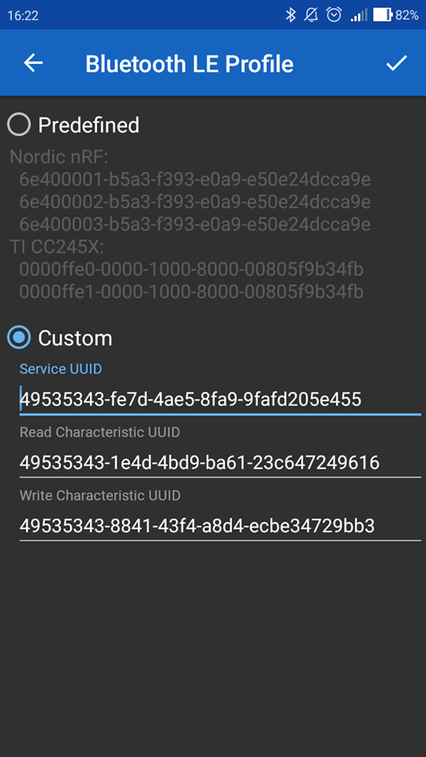

# Arduino controlled autonomous slotcar


[KiCad project](docs/hw)

## Installations

[Linux-based systems](install/README.md)

## Usage

[Linux-based systems](firmware/README_linux.md)

[Microchip Studio](firmware/README.md)

## TODO: Bluetooth GATT

```shell
# UUID service:  
49535343-FE7D-4AE5-8FA9-9FAFD205E455  
# UUID write charasteristic
49535343-8841-43F4-A8D4-ECBE34729BB3  
# UUID read charasteristic
49535343-1E4D-4BD9-BA61-23C647249616  
```

configuration [Serial-Bluetooth](https://play.google.com/store/apps/details?id=de.kai_morich.serial_bluetooth_terminal&hl=cs)  


