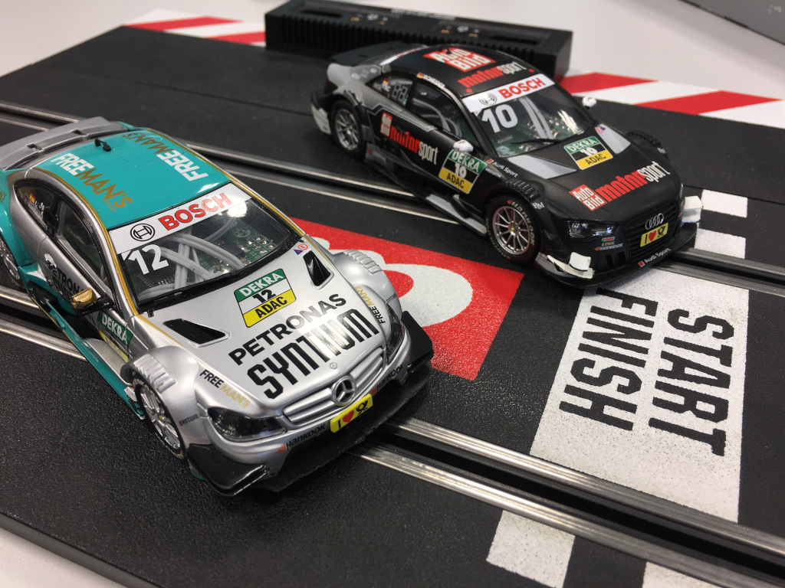
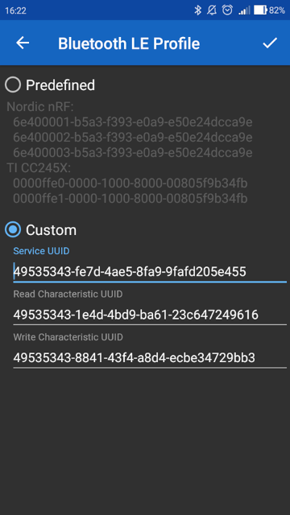

# Arduino controlled autonomous slot car

The repository contains AVR lab project for bachelor course [*Digital Electronics 2*](https://www.vut.cz/en/students/courses/detail/242365) at Brno University of Technology, Czechia.



## Hardware

[Schematics](docs/arcar.pdf)

[KiCad project](docs/hw)


## Software installation

[Ubuntu-based Linux distributions](install/README_linux.md)

[Windows](install/README.md)

## Usage

[Ubuntu-based Linux distributions](firmware/README_linux.md)

[Microchip Studio](firmware/README.md)

## TODO: Bluetooth GATT

```shell
# UUID service:  
49535343-FE7D-4AE5-8FA9-9FAFD205E455  
# UUID write charasteristic
49535343-8841-43F4-A8D4-ECBE34729BB3  
# UUID read charasteristic
49535343-1E4D-4BD9-BA61-23C647249616  
```

configuration [Serial-Bluetooth](https://play.google.com/store/apps/details?id=de.kai_morich.serial_bluetooth_terminal&hl=cs)  


