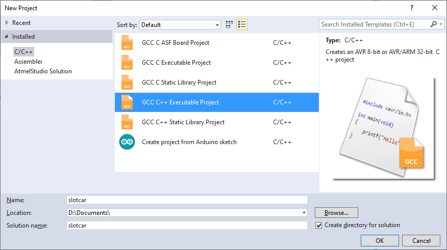
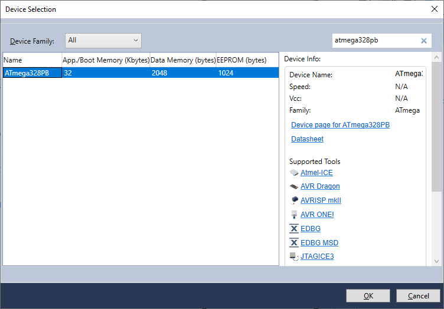
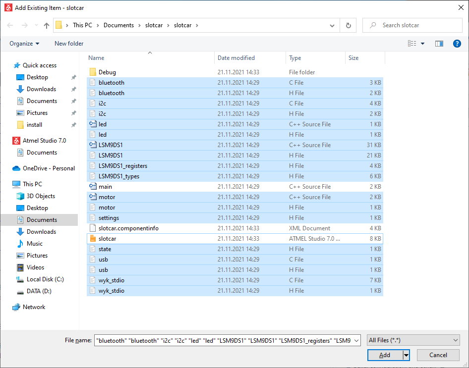
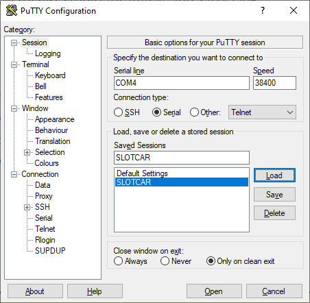

# HOWTO use slotcar template in Microchip Studio

1. Start Microchip Studio and create a new `GCC C++ Exacutable Project`.

   

2. Select `ATmega328PB` device.

   

3. To the newly created project folder, copy all source and header files from this repository. In **Solution Explorer** click on the project name, then in menu **Project**, select **Add Existing Item... Shift+Alt+A** and add all source and header files.

   

4. Build project in menu **Build > Build Solution F7**.

5. Connect a slotcar to USB cabel and in menu **Tools** select **Send to Arduino SlotCar** to flash the firmware.

6. Start PuTTY, open serial communication with the slot car (mode 8N1, 38400 Bd) and receive sensor values.

   
