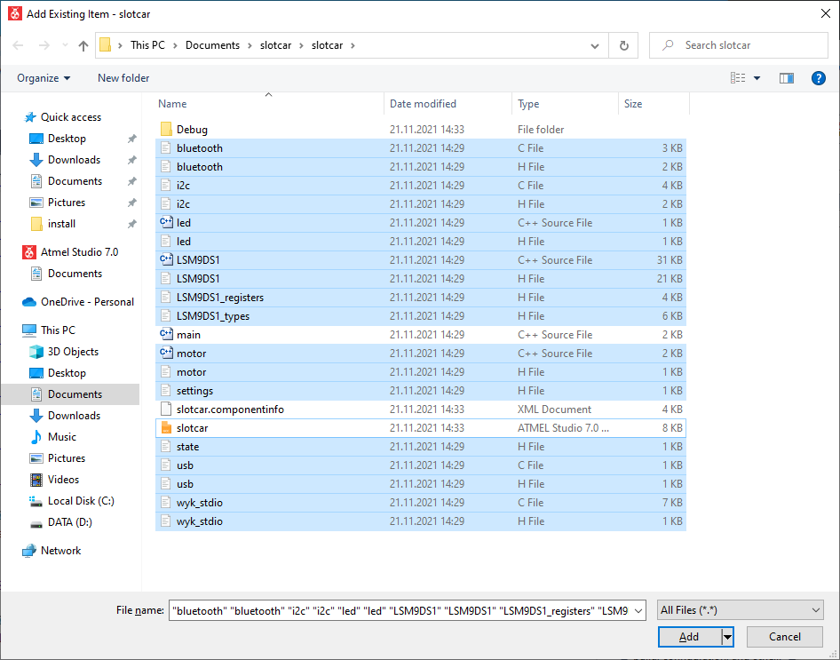

## HOW TO use template in Microchip Studio

1. Run Microchip Studio and create a new `GCC C++ Exacutable Project`.

   

2. Select `ATmega328PB` device.

   

3. To new created project folder, copy all source and header files from this repository. In **Solution Explorer** click on the project name, then in menu **Project**, select **Add Existing Item... Shift+Alt+A** and add all source and header files.

   

4. Build project in menu **Build > Build Solution F7**. 

5. If not already done, add the following lines to your `avrdude.conf` file:

```bash
#------------------------------------------------------------
# ATmega328PB
#------------------------------------------------------------

part parent "m328"
    id                  = "m328pb";
    desc                = "ATmega328PB";
    signature           = 0x1e 0x95 0x16;

    ocdrev              = 1;
        
    memory "efuse"
                size = 1;
                min_write_delay = 4500;
                max_write_delay = 4500;
                read = "0 1 0 1 0 0 0 0 0 0 0 0 1 0 0 0",
                           "x x x x x x x x o o o o o o o o";

                write = "1 0 1 0 1 1 0 0 1 0 1 0 0 1 0 0",
                                "x x x x x x x x x x x x i i i i";
    ;
        
;
```

6. If not already done, in menu **Tools** create a new **External Tools...** as follows:

```
Title: Send to Arduino SlotCar
Command: C:\APPZ\Avr\avrdude.exe
Arguments: -p m328p -c arduino -D -V -u -q -U flash:w:$(TargetName).hex:i -P COM4
Initial directory: $(TargetDir)
Use Output window: checked
```
   

7. Connect a slotcar to USB cabel and in menu **Tools** select **Send to Arduino SlotCar** to flash the firmware.
