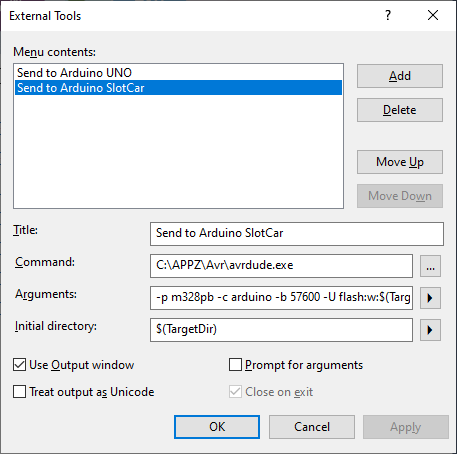

# HOWTO install slot car tools for Windows

1. Download and install [Microchip Stuio](https://www.microchip.com/en-us/development-tools-tools-and-software/microchip-studio-for-avr-and-sam-devices).

2. Download and install [git version control](https://git-scm.com/).

3. Download latest [avrdude](http://savannah.nongnu.org/projects/avrdude) programmer and extract archive `avrdude-6.3-mingw32.zip` to `C:\APPZ\Avr\`.

4. Add the following lines to your `avrdude.conf` file:


   ```bash
   #------------------------------------------------------------
   # ATmega328PB
   #------------------------------------------------------------

   part parent "m328"
       id                  = "m328pb";
       desc                = "ATmega328PB";
       signature           = 0x1e 0x95 0x16;

       ocdrev              = 1;
        
       memory "efuse"
                size = 1;
                min_write_delay = 4500;
                max_write_delay = 4500;
                read = "0 1 0 1 0 0 0 0 0 0 0 0 1 0 0 0",
                           "x x x x x x x x o o o o o o o o";

                write = "1 0 1 0 1 1 0 0 1 0 1 0 0 1 0 0",
                                "x x x x x x x x x x x x i i i i";
       ;
        
   ;
   ```

5. Run Git Bash, create a home folder for local repository, and clone this repo:

   ```bash
   cd d:/Documents/
   mkdir GIT
   cd GIT
   git clone https://github.com/tomas-fryza/arduino-slotcar
   ```

6. Run Microchip Studio and in menu **Tools** create a new **External Tools...** as follows (use your path to `avrdude.exe` and specify your COM port):

   | Parameter | Value |
   | :-- | :-- |
   | Title: | `Send to Arduino SlotCar`
   | Command: | `C:\APPZ\Avr\avrdude.exe`
   | Arguments: | `-p m328pb -c arduino -b 57600 -U flash:w:$(TargetName).hex:i -P COM4`
   | Initial directory: | `$(TargetDir)`
   | Use Output window: | checked

   

   Note that, in Windows you can find and/or verify the COM port by Device Manager:

   

7. Usage of slot car template can be found [here](../firmware/README.md).
